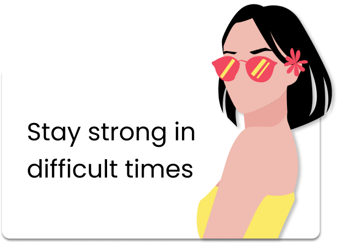
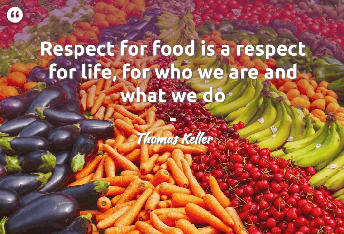

<!DOCTYPE html>
<html lang="en">
	<head>
		<meta charset="utf-8">
		
		<title>Kshitija's Portfolio</title>
		<meta name="keywords" content="">
		<meta name="description" content="">
		<meta http-equiv="X-UA-Compatible" content="IE=Edge">
		<meta name="viewport" content="width=device-width, initial-scale=1">
		
		<link rel="stylesheet" href="css/animate.min.css">
		<link rel="stylesheet" href="css/bootstrap.min.css">
		<link rel="stylesheet" href="css/font-awesome.min.css">
		<link href='http://fonts.googleapis.com/css?family=Open+Sans:400,300,600,700' rel='stylesheet' type='text/css'>
		<link rel="stylesheet" href="css/templatemo-style.css">
		
		
        
		
		
		
	</head>
	<body id="top">

		
    	<!-- start navigation -->
		<nav class="navbar navbar-default templatemo-nav" role="navigation">
			

				

					<button class="navbar-toggle" data-toggle="collapse" data-target=".navbar-collapse">
						
						
						
					</button>
				

				

					<ul class="nav navbar-nav navbar-right">
						<li><a href="#top">HOME</a></li>
						<li><a href="#about">ABOUT</a></li>
						<li><a href="#skills">SKILLS</a></li>
						<li><a href="#service">WORK</a></li>
						<li><a href="#portfolio">PROJECTS</a></li>
						<li><a href="#contact">CONTACT</a></li>
					</ul>
				

			

		</nav>
		<!-- end navigation -->

    	<!-- start home -->
    	<section id="home">
    		

    			

    				

    					<h1 class="wow fadeIn" data-wow-offset="50" data-wow-delay="0.9s">I am Kshitija Bharambe</h1>
    					

                            
Web Developer

                            
Graphic Designer

                            
Design Catalyst@DSCRAIT

							
TEDster@TEDXDypatiluniversity

                        

    					<a data-scroll href="#about" class="btn btn-default wow fadeInUp" data-wow-offset="50" data-wow-delay="0.6s">GET STARTED</a>
    				

    			

    		

    	</section>
    	<!-- end home -->

    	<!-- start about -->
		<section id="about">
			

				

					

    					<h2 class="wow bounceIn" data-wow-offset="50" data-wow-delay="0.3s">ABOUT ME </h2>
    				

					<section id="about" class="about-mf sect-pt4 route">
						

						  

							

							  

								 

								  

									 

									  
 
										

										  
										

									  

									  

										

										  
Name:  Kshitija Shashank Bharambe

										  
Email:  bharambekshitija2@gmail.com

										 
										

									

								
									
Hey there, greetings of the day!
										 
									  I am currently pursuing my bachelor's degree in Computer Science at Ramrao Adik Institute of
									  Technology, Nerul.
									     
									  I look forward to contribute to open source. I have done two internships as a web developer. Apart from technical skills, I have remarkable management skills, leadership
									  qualities.
									    
									  My communication skills have paved many paths for me and have gifted me with opportunities to
									  learn and explore. I am always ready to help people. I am praised for my
									  punctuality and my ability to adhere to the deadlines.
									   
									  Fun facts: I am a international level Karate player, a football player and I love listening
									  to music.	

							
									

    	<!-- start skills -->
    	<section id="skills">
    		

    			

    				<section id="skills" class="secPad white">
						

						

								<!-- Heading -->
								

									

										<h2 class="wow bounceIn" data-wow-offset="50" data-wow-delay="0.3s">MY SKILLS</h2>
									

							

								

									<h2>Programming <strong>Skills</strong></h2>
									

										It takes knowledge, smart work, and dedication to make great ideas come to life.
								
									

									

										
HTML5

										

											

												

													90% Complete
												

											

										

									

									

										
CSS/CC3

										

											

												

													90% Complete
												

											

										

									

									

										
JavaScript

										

											

												

													80% Complete
												

											

										

									

									

										
Boostrap

										

											

												

													75% Complete
												

											

										

									

									

										
Dart

										

											

												

													65% Complete
												

											

										

									

									

										
C/C++

										

											

												

													80% Complete
												

											

										

									

									

										
JQuery

										

											

												

													50% Complete
												

											

										

									

								

								

									<h2>Designing <strong>Skills</strong></h2>
									

										Problem solving is not always about sitting in a board room talking about the way things should be done. I have a strong background in UI design which allows me to think on my feet and act upon it.
								
									

									

										
Photoshop

										

											

												

													90% Complete
												

											

										

									

									

										
Illustrator

										

											

												

													80% Complete
												

											

										

									

									

										
PremierePro

										

											

												

													50% Complete
												

											

										

									

									

										
Figma

										

											

												

													85% Complete
												

											

										

									

									

										
AdobeXD

										

											

												

													75% Complete
												

											

										

									

								

							

						
        
					</section>
					
    	<!-- end skills -->

    	<!-- start Work experience -->
    	<section id="service">
    		

    			

    				

    					<h2 class="wow bounceIn" data-wow-offset="50" data-wow-delay="0.3s">WORK EXPERINCE</h2>
    				

					

    					<i class="fa fa-code"></i>
    					<h4>Web Developer Intern</h4>
						<h5>@Software Developemt Group, RAIT</h5>
    					
Worked on a project titled as Rakshanti.This is an innovative idea which can be used to aid personal safety. This is an attempt to make safer decision about your mobility.The app will address the issue of identification of the crime and  prevention of crime.

    				

					

    					<i class="fa fa-code"></i>
    					<h4>Web Developer Intern</h4>
						<h5>@The Spark Foundation</h5>
    					
A simple payment gateway integration was implemented. Razor pay was used as a payment method for donation for the needy ones for sharing food.

    				

    				

    					<i class="fa fa-paint-brush"></i>
    					<h4>Design Catalyst</h4>
						<h5>@Developer student club,RAIT</h5>
    					
Simple designs for marketing a event, brochure for hack-a-thon,Informative post were created.

    				

    				
    			

    		

			

    			

					

    					<i class="fa fa-code"></i>
    					<h4>Technical Team Member</h4>
						<h5>@KALARAAG, RAIT</h5>
    					
Worked on photography site and enhanced its UI. Also Designing graphics for event, Editing videos of events. Maintaing database.

    				

					

    					<i class="fa fa-laptop"></i>
    					<h4>TEDster</h4>
						<h5>@TEDXDypatiluniversity</h5>
    					
Focuses on advancement as well as promotion of TEDXDypatiluniversity. Participating in Events such as Debates, different competitions etc.

    				

    				
    			

    		

    	</section>
    	<!-- end servie -->

    	<!-- start projects -->
    	<section id="portfolio">
    		

    			

    				

    					<h2 class="wow bounceIn" data-wow-offset="50" data-wow-delay="0.3s">PROJECTS</h2>
    				

    				

                        

    					   
                                

                                    <h4>NIYAMO</h4>
                                    
Mobile app to help women overcome imposter syndrome

                                    <a href="https://www.youtube.com/watch?v=VKJAvVdBepI&feature=youtu.be" class="btn btn-default">DETAIL</a>
                                

                        

    				

    				

                        

                           
                                

                                    <h4>Thankfoodie</h4>
                                    
Website for food management and food donation

                                    <a href="https://github.com/kshitija-2001/thankfoodie" class="btn btn-default">DETAIL</a>
                                

                        

                    

                    

                        

                           
                                

                                    <h4>Rakshanti- A saftey App</h4>
                                    
A web app which provides safety to the user.

                                    <a href="#" class="btn btn-default">DETAIL</a>
                                

                        

                    

                    

                        

                           
                                

                                    <h4>Payment gateway integration</h4>
                                    
A platform to donate amount for needy people.

                                    <a href="https://kshitija-2001.github.io/sparks/" class="btn btn-default">DETAIL</a>
                                

                        

                    

                    
                    

                        

                    

    			

    		

    	</section>
    	<!-- end portfolio -->

    	<!-- start contact -->
    	<section id="contact">
    		

    			

    				

    					<h2 class="wow bounceIn" data-wow-offset="50" data-wow-delay="0.3s">GET IN TOUCH</h2>
						
Connect with me!  We can discuss some designs or definetly talk about Football.

					

    				

    					
                                   <address>
    						<!-- 
<i class="fa fa-phone"></i> 010-020-0340
 -->
    						
<i class="fa fa-envelope-o"></i> bharambekshitija2@gmail.com

    						</address>
    					<ul class="social-icon">
    						<li><h4>SOCIAL HANDLES</h4></li>
    						<li></li>
    						<li></li>
    						<li></li>
							<li></li>
    					</ul>
    				

    			

    		

    	</section>
    	<!-- end contact -->

        <!-- start copyright -->
        <!-- <footer id="copyright">
            

                

                    

                        

                       	Copyright &copy; 2084 Company Name

                    

                

            

        </footer> -->
        <!-- end copyright -->

	</body>
</html>
